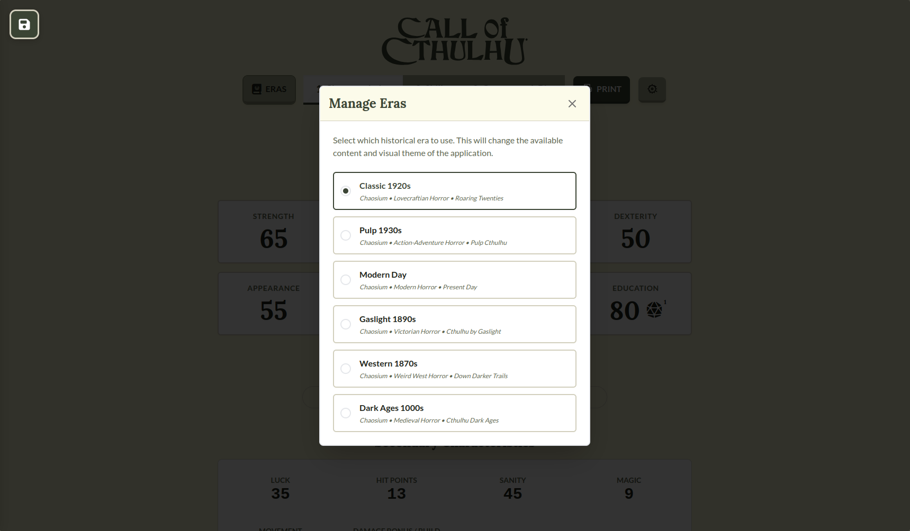
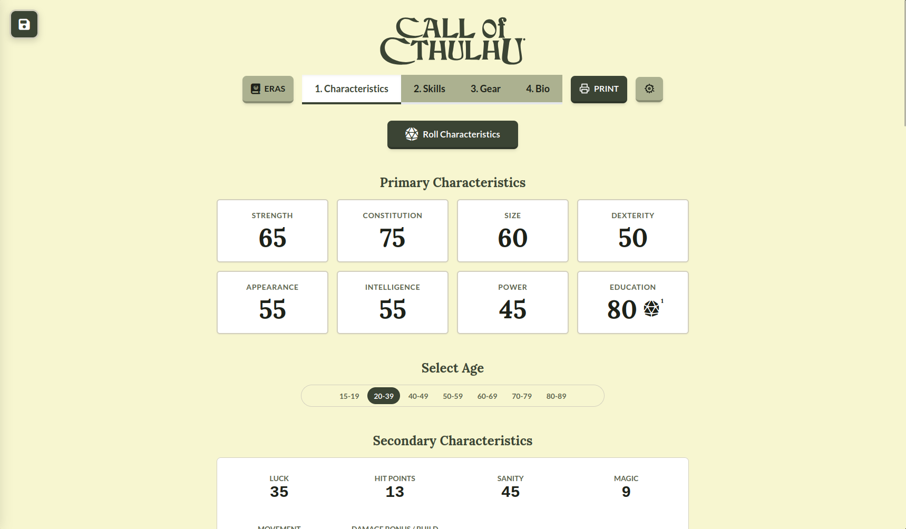
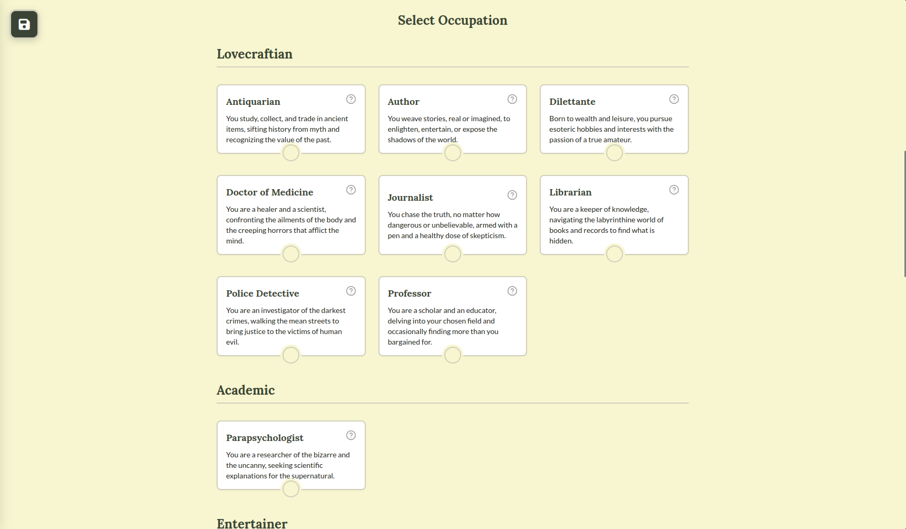
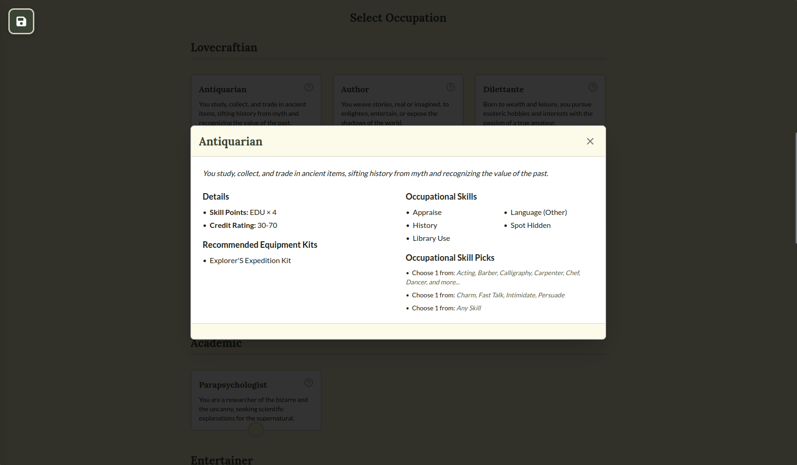
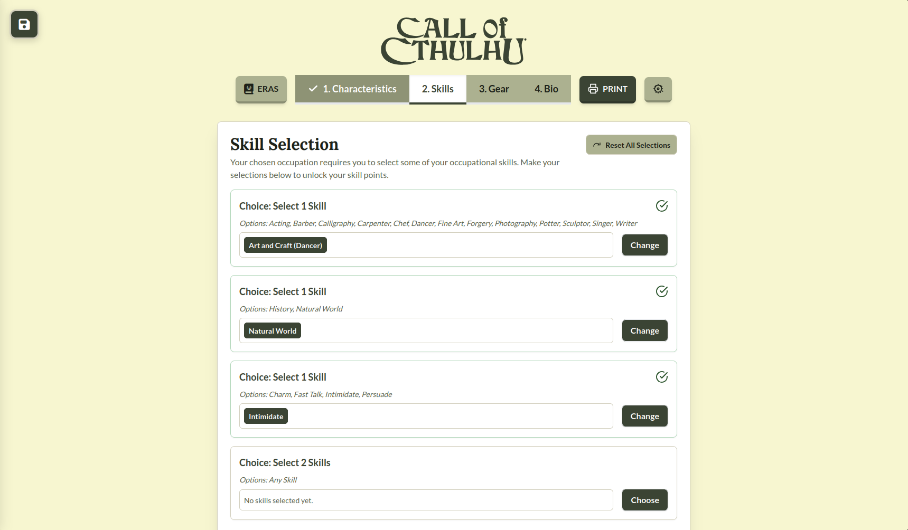
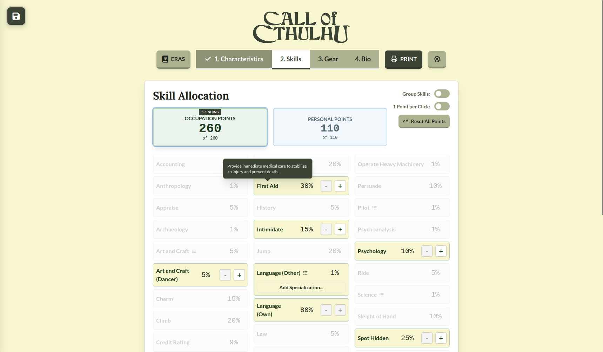
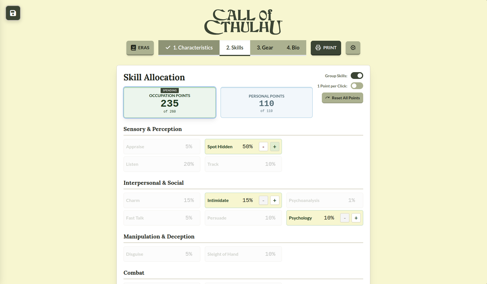
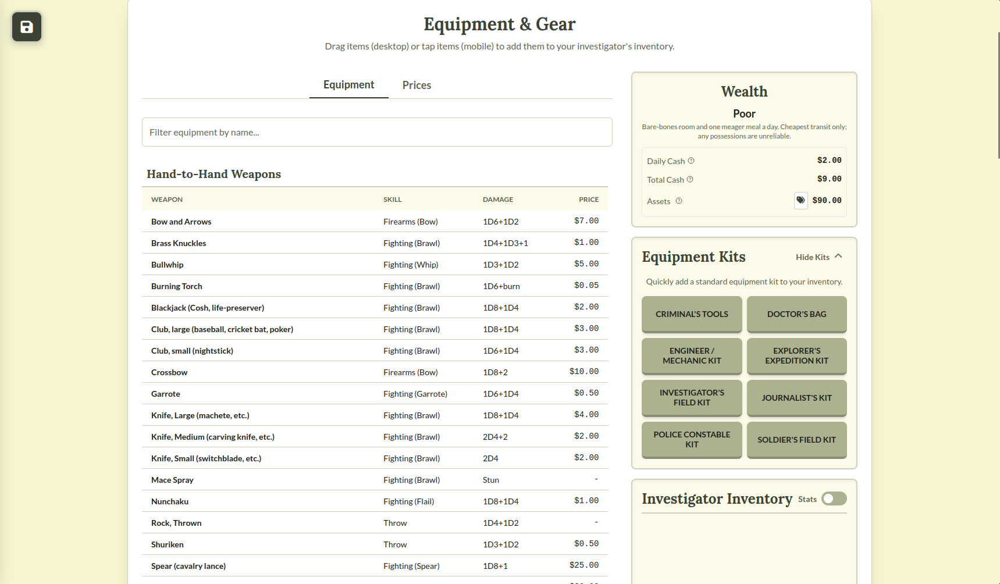
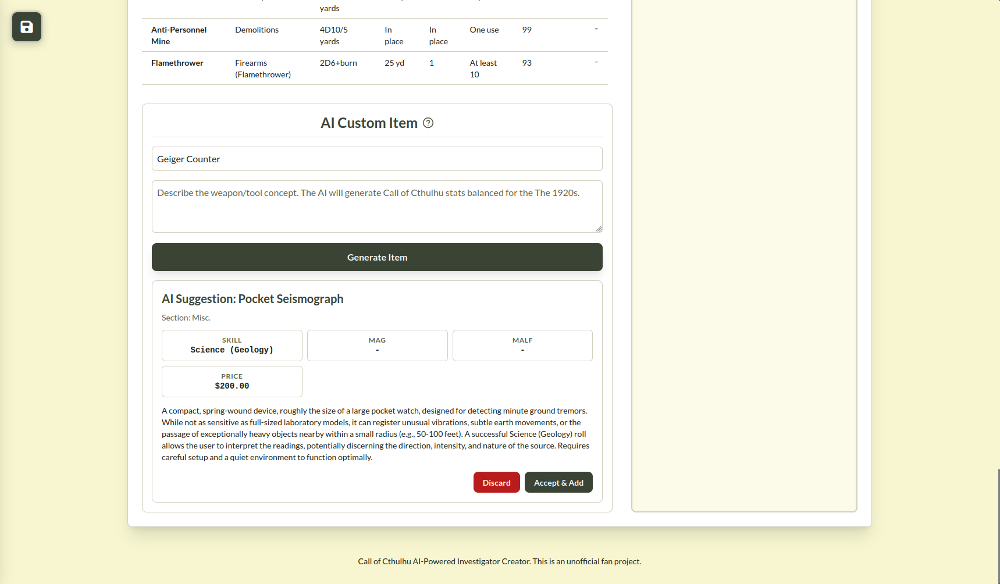
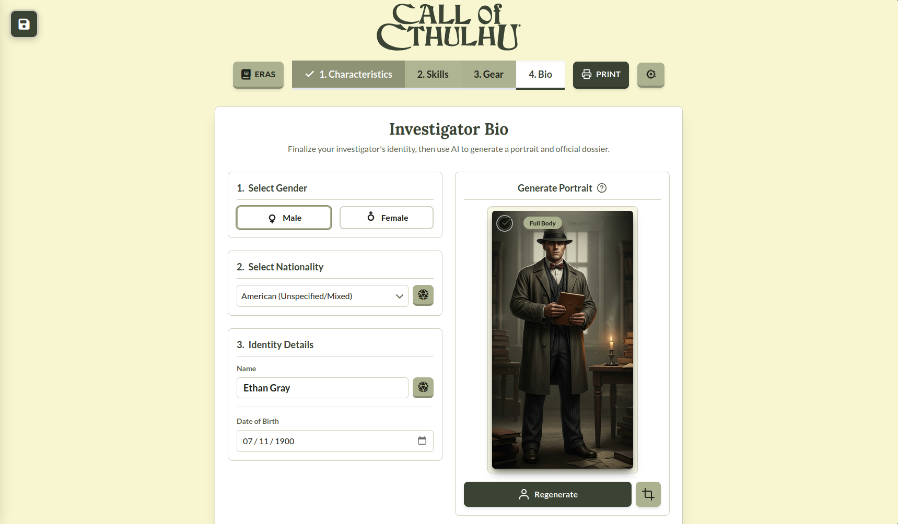

# Call of Cthulhu Character Creator (The New Dhole's House)

An interactive, React-based tool that fills the Call of Cthulhu 7e Classic 1920s character sheet PDF. It supports AI-assisted identity and portrait generation, specialized skill mapping, gear blocks, and one-click PDF export with correct field layouts.

This is an unofficial fan project, not affiliated with Chaosium Inc. All trademarks and copyrights are their own.

## Badges


## Features

### 1) Choose Your Era

Switch between supported eras (Classic 1920s, Pulp 1930s, Modern Day, Gaslight 1890s, Western 1870s, Dark Ages 1000s). Each era adjusts the available occupations, gear, theme, and sheet expectations.

<p align="center">
  
</p>

### 2) Roll Characteristics

Roll your investigator's characteristics and derived stats, then pick an age bracket (with era-aware date-of-birth support).

<p align="center">
  
</p>

### 3) Pick An Occupation

Choose an occupation with clear context about skill point formulas, credit rating, and recommended equipment kits.

<p align="center">
  
  
</p>

### 4) Choose Occupational Skill Picks

Some occupations require you to pick specific occupational skills before you can allocate points.

<p align="center">
  
</p>

### 5) Allocate Skill Points

Spend occupation and personal points with fast controls, optional grouping, and specialization handling (Art/Craft, Languages, Science, etc.).

<p align="center">
  
  
</p>

### 6) Gear Up

Browse and filter equipment, apply a kit in one click, manage cash and assets, and build an investigator inventory that prints cleanly onto the sheet.

<p align="center">
  
</p>

### 7) AI-Assisted Custom Gear (Optional)

Generate custom items with AI and accept them into your inventory (optional).

<p align="center">
  
</p>

### 8) Bio, Portrait, And PDF Export

Finalize identity details, optionally generate a portrait, then use PRINT to export a filled, print-ready character sheet PDF (including skills, gear, cash/assets, and portrait).

<p align="center">
  
</p>

## Getting Started

### Prerequisites

- Node.js 18+
- npm

### Install & Run (Dev)

```bash
npm install
npm run dev
```

### Build (Production)

```bash
npm install
npm run build
npm run preview
```

## Character Sheet

This repo includes the Classic 1920s sheet at `public/sheets/coc1920s.pdf`. Production builds copy it to `dist/sheets/coc1920s.pdf`.

You can switch between internal, external, and self-hosted PDF sources in the in-app Settings menu.

## Environment Variables

AI features require a Google Gemini API key (optional).

- Copy `.env.example` to `.env`
- Set `VITE_GEMINI_API_KEY` (or `GEMINI_API_KEY`) to your key

```bash
cp .env.example .env
```

If you do not set a key, the app will still work; AI features will be disabled.

## Scripts

- `npm run dev` - start Vite dev server
- `npm run build` - production build
- `npm run preview` - preview the production build
- `npm test` - run tests

## Legal

Content is provided for personal, non-commercial use in tabletop role-playing games.

## License

MIT. See `LICENSE`.
