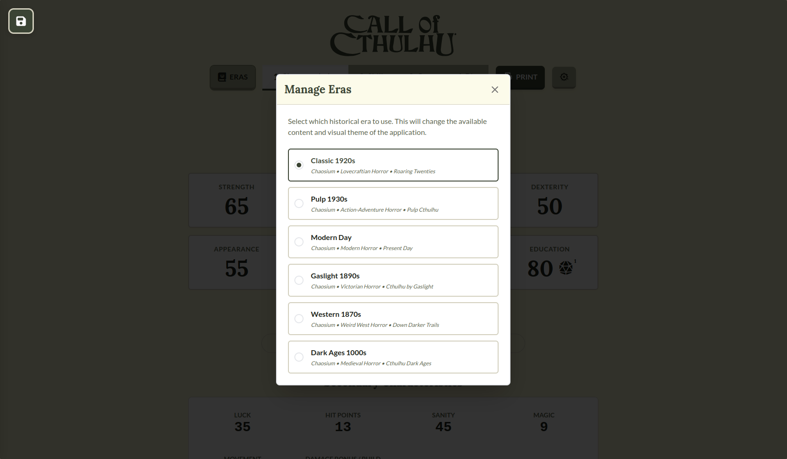
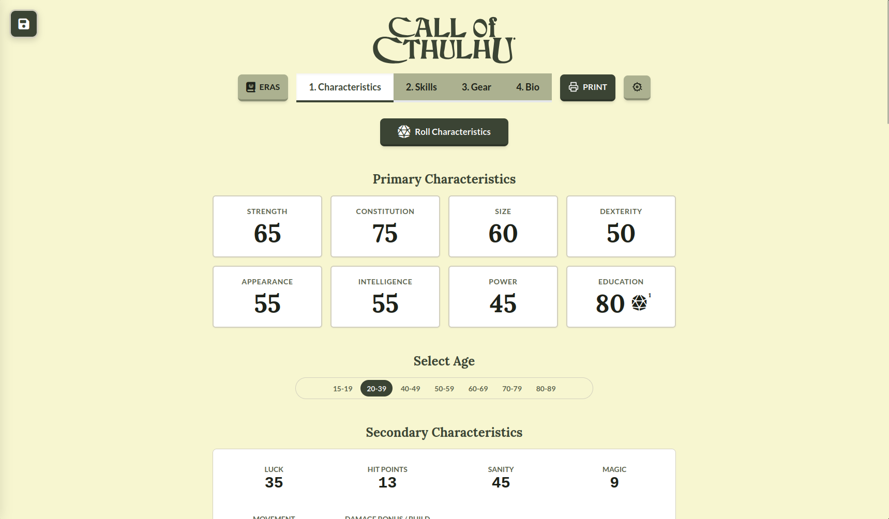
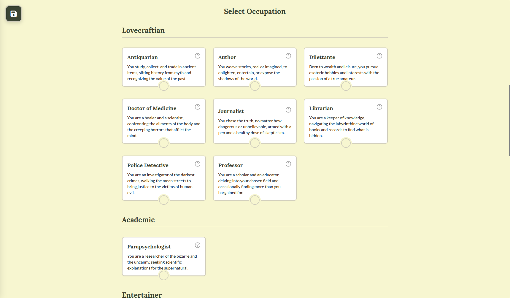
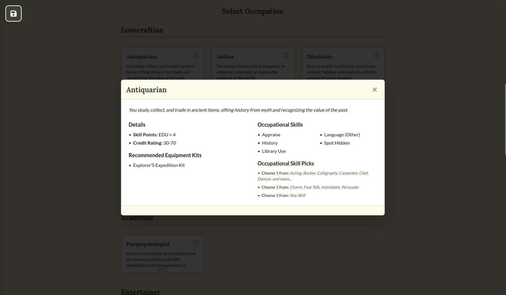
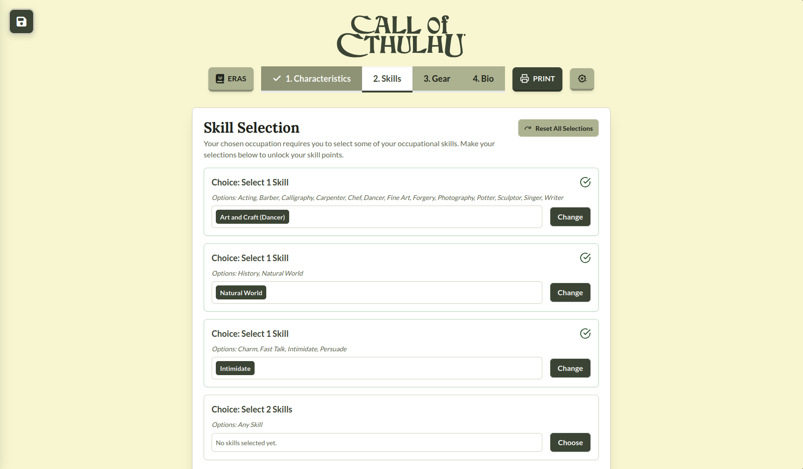
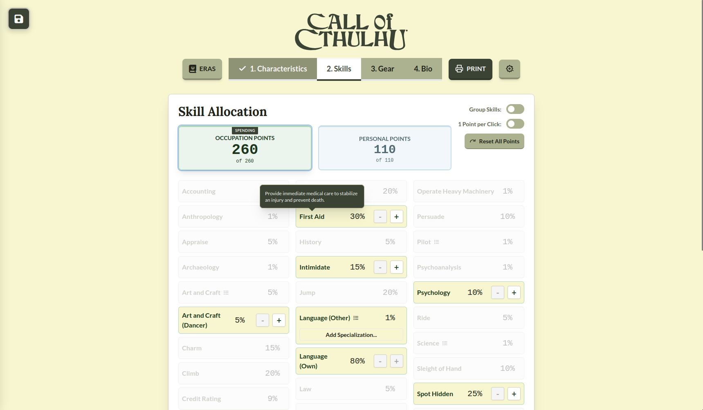
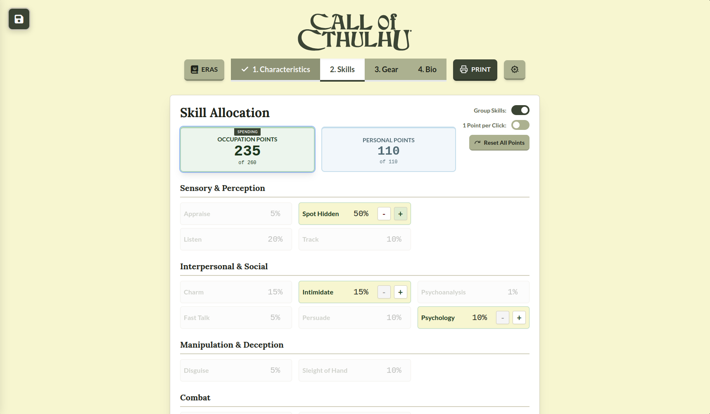
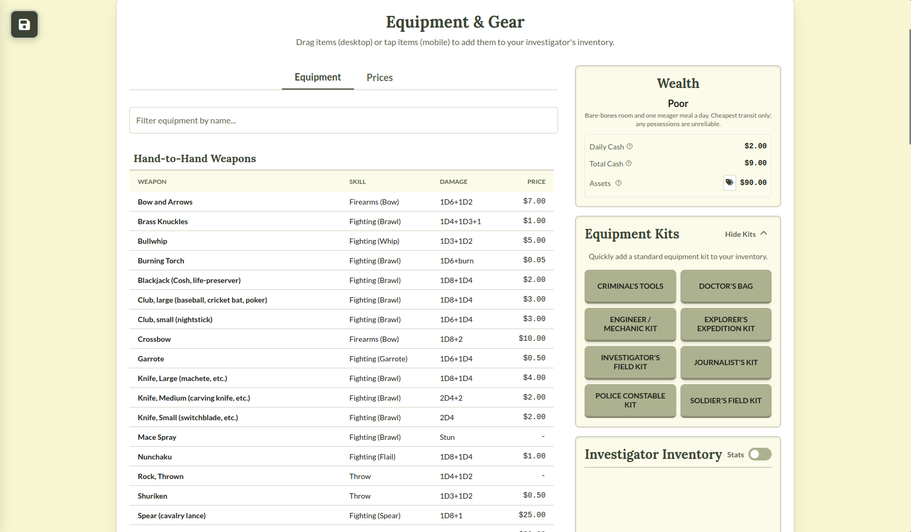
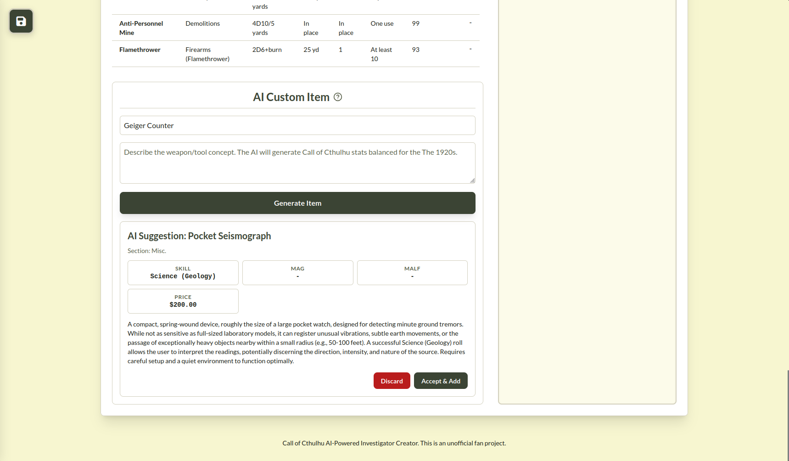
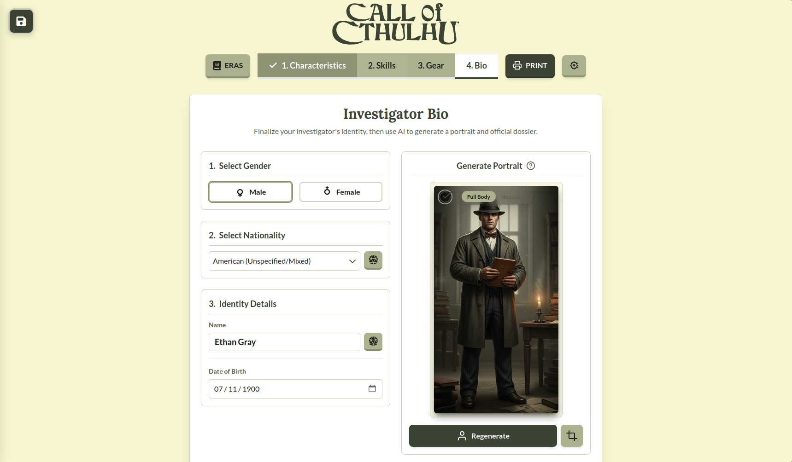

# Call of Cthulhu Character Creator (The New Dhole's House)

<!-- markdownlint-disable MD013 MD033 MD045 -->

An interactive, React-based tool that fills the Call of Cthulhu 7e Classic 1920s character sheet PDF. It supports AI-assisted identity and portrait generation, specialized skill mapping, gear blocks, and one-click PDF export with correct field layouts.

This is an unofficial fan project, not affiliated with Chaosium Inc. All trademarks and copyrights are their own.

## Badges


## Features

### 1) Choose Your Era

Switch between supported eras (Classic 1920s, Pulp 1930s, Modern Day, Gaslight 1890s, Western 1870s, Dark Ages 1000s). Each era adjusts the available occupations, gear, theme, and sheet expectations.

<p align="center">
  
</p>

### 2) Roll Characteristics

Roll your investigator's characteristics and derived stats, then pick an age bracket (with era-aware date-of-birth support).

<p align="center">
  
</p>

### 3) Pick An Occupation

Choose an occupation with clear context about skill point formulas, credit rating, and recommended equipment kits.

<p align="center">
  
  
</p>

### 4) Choose Occupational Skill Picks

Some occupations require you to pick specific occupational skills before you can allocate points.

<p align="center">
  
</p>

### 5) Allocate Skill Points

Spend occupation and personal points with fast controls, optional grouping, and specialization handling (Art/Craft, Languages, Science, etc.).

<p align="center">
  
  
</p>

### 6) Gear Up

Browse and filter equipment, apply a kit in one click, manage cash and assets, and build an investigator inventory that prints cleanly onto the sheet.

<p align="center">
  
</p>

### 7) AI-Assisted Custom Gear (Optional)

Generate custom items with AI and accept them into your inventory (optional).

<p align="center">
  
</p>

### 8) Bio, Portrait, And PDF Export

Finalize identity details, optionally generate a portrait, then use PRINT to export a filled, print-ready character sheet PDF (including skills, gear, cash/assets, and portrait).

<p align="center">
  
</p>

### 9) Multi-Provider AI Settings (v1.1)

Open **Settings → AI** to configure four independent slots:

| Slot | Typical use |
|------|-------------|
| Creative writing | Bio, backstory, skill distribution analysis |
| Simple writing | Names, short JSON helpers |
| Vision | Portrait analysis / crop helpers |
| Image | Portraits and expressive images |

Each slot picks its own **provider**, **remembered API key**, and **model**. Supported providers include OpenAI, Anthropic, Google Gemini, OpenRouter, **xAI Grok** (API key or SuperGrok OAuth), **Z.ai GLM Coding Plan**, DeepSeek, and OpenCode Go.

xAI OAuth shows a **device code** and opens the browser for approval — no API key field for that mode.

## Getting Started

### Prerequisites

- Node.js 18+
- npm

### Install & Run (Dev)

```bash
npm install
npm run dev
```

### Build (Production)

```bash
npm install
npm run build
npm run preview
```

## Character Sheet

This repo includes the Classic 1920s sheet at `public/sheets/coc1920s.pdf`. Production builds copy it to `dist/sheets/coc1920s.pdf`.

You can switch between internal, external, and self-hosted PDF sources in the in-app Settings menu.

## Environment Variables

AI keys are optional. Paste keys in **Settings** (remembered per provider) or
bake them into the dev build via `.env`:

| Variable | Provider |
|----------|----------|
| `VITE_GEMINI_API_KEY` / `GEMINI_API_KEY` | Google Gemini |
| `VITE_OPENROUTER_API_KEY` / `OPENROUTER_API_KEY` | OpenRouter |
| `VITE_OPENAI_API_KEY` / `OPENAI_API_KEY` | OpenAI |
| `VITE_ANTHROPIC_API_KEY` / `ANTHROPIC_API_KEY` | Anthropic |
| `VITE_DEEPSEEK_API_KEY` / `DEEPSEEK_API_KEY` | DeepSeek |
| `VITE_OPENCODE_GO_API_KEY` / `OPENCODE_GO_API_KEY` | OpenCode Go |
| `VITE_ZHIPU_API_KEY` / `VITE_ZAI_API_KEY` | Z.ai GLM Coding Plan |
| `VITE_XAI_API_KEY` / `XAI_API_KEY` | xAI Grok (API key mode) |

```bash
cp .env.example .env
```

Without keys the app still runs; AI features unlock when you add a key or complete
xAI OAuth in Settings. For SuperGrok OAuth, use `npm run dev` (device login needs
the Vite OAuth proxy).

## Development Docs

- `AGENTS.md` - project operating contract
- `TODO.md` - active work queue
- `DEVELOPMENT_PLAN.md` - forward-looking plan
- `DEVELOPMENT_LOG.md` - dated engineering log
- `docs/OPTIMIZATION_PROPOSAL.md` - v1.1 performance program (complete)
- `docs/SHARED_AI_PROVIDERS_ZHIPU_GROK.md` - multi-slot AI + Zhipu/xAI (shared)
- `RELEASE_CHECKLIST.md` - publish and sync checklist
- `SECURITY.md` - repository security defaults

## Scripts

- `npm run dev` - start Vite dev server
- `npm run build` - production build
- `npm run preview` - preview the production build
- `npm test` - run tests
- `npm run test:watch` - run Vitest in watch mode
- `npm run typecheck` - TypeScript check

## Legal

Content is provided for personal, non-commercial use in tabletop role-playing games.

## License

MIT. See `LICENSE`.
