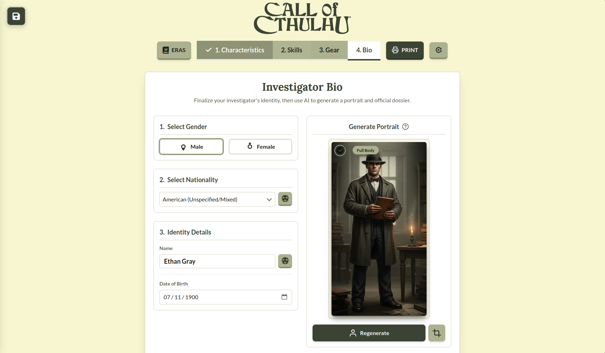

<!-- markdownlint-disable MD013 -->

# Call of Cthulhu Character Creator

Build the investigator your next mystery needs, from the first characteristic
roll to a filled Call of Cthulhu 7e sheet. Choose an era, follow its occupation
and equipment rules, and keep optional AI details out of the way until you want
them.


This React app turns investigator creation into a guided four-part workflow: characteristics, skills, gear, and bio. Each supported era supplies its own occupations, rules, prices, equipment, visual theme, and sheet mapping where available. Core creation works without an AI account; provider-backed names, portraits, and skill-allocation help are optional.



The final bio brings identity, portrait, and print controls together before
you export the sheet.

## What's New in v1.1.0

- Configure creative writing, short text, vision, and image generation independently, each with its own provider and model.
- Add xAI API-key or SuperGrok device-code access, plus Z.ai GLM Coding Plan support.
- Load era catalogs, model lists, and print tooling only when needed for a faster first visit and calmer skill editing.
- Import saves from a file or clipboard, download character JSON, and surface load failures instead of silently ignoring them.

See the full [v1.1.0 changelog](CHANGELOG.md#110---2026-07-27).

## What You Can Do

- **Create investigators across eight eras.** Choose Classic 1920s, Pulp 1930s, Modern Day, Gaslight 1890s, Western 1870s, Dark Ages 1000s, Regency Cthulhu, or Campfire Tales.
- **Roll characteristics with era-aware age rules.** Derived statistics, date-of-birth handling, age adjustments, and applicable era mechanics update from the selected roll and age bracket.
- **Choose occupations with context.** Review skill-point formulas, credit ranges, equipment guidance, experience packages, talents, or archetypes when the active era provides them.
- **Allocate skills without losing the rules.** Spend occupational and personal points, complete required picks, and handle families such as Art/Craft, Languages, Science, Fighting, and Firearms.
- **Build an era-appropriate inventory.** Search prices and gear, apply occupation kits, track wealth, and combine kit items with manual inventory choices.
- **Support Campfire investigators.** Use scout ranks, hobbies, ability badges, distress and adversity tracks, backstory fields, and the dedicated Campfire sheet flow.
- **Add optional AI assistance.** Generate identity details and portraits or ask for an era-aware skill distribution, with separate providers for different jobs.
- **Save and print the result.** Keep browser-local slots, move characters as JSON, and export supported data and portraits to a filled PDF.

## First Investigator

1. Open **Eras** and select the setting before rolling.
2. Roll characteristics, choose an age bracket, then select an occupation and any era-specific package, talent, or archetype.
3. Complete required occupational picks and spend the available skill points.
4. Choose gear, finish the bio, save a copy, and select **Print** when the sheet is ready.

## Installation

### Requirements

- Node.js 18 or later
- npm

```bash
git clone https://github.com/apoapostolov/Call-of-Cthulhu-Character-Creator.git
cd Call-of-Cthulhu-Character-Creator
npm install
npm run dev
```

For a production preview:

```bash
npm run build
npm run preview
```

## Character Sheets

The repository bundles `public/sheets/coc1920s.pdf` and `public/sheets/campfiretales.pdf`. The in-app settings also support internal, external, and self-hosted PDF sources. An era can still provide creation data even when you need to supply its matching sheet separately.

PDF export uses era-specific field maps, specialized skill packing, multiline fields, inventory and wealth data, and the selected portrait where the active sheet supports them.

## Optional AI Setup and Privacy

Open **Settings → AI** to configure four task slots:

| Slot | Used for |
| --- | --- |
| Creative writing | Longer text and skill-distribution analysis |
| Simple writing | Names and short structured responses |
| Vision | Portrait description and crop analysis |
| Image | Portrait generation |

Supported providers include OpenAI, Anthropic, Google Gemini, OpenRouter, xAI, Z.ai, DeepSeek, and OpenCode Go. xAI supports either an API key or SuperGrok device-code approval.

Keys entered in Settings are remembered in browser storage and sent to the selected provider when you run an AI action. Build-time environment keys are optional; the supported variable names are documented in [the provider notes](docs/SHARED_AI_PROVIDERS_ZHIPU_GROK.md). The character creator still runs when no key is configured.

SuperGrok device login relies on the Vite `/__xai_oauth` proxy. Use `npm run dev`, or provide the same reverse-proxy route on a static deployment.

## Development

```bash
npm test
npm run typecheck
npm run build
```

The application starts in `index.tsx` and is coordinated by `App.tsx`. Era metadata lives in `eras/manifest.ts`; each era loads its own data bundle on demand. See [SECURITY.md](SECURITY.md), [the active work queue](TODO.md), and [the release checklist](RELEASE_CHECKLIST.md) before publishing changes.

## Legal

This is an unofficial fan project and is not affiliated with Chaosium Inc. Trademarks and game copyrights belong to their respective owners. Game content is provided for personal, non-commercial tabletop use.

The project code is released under the [MIT License](LICENSE).
